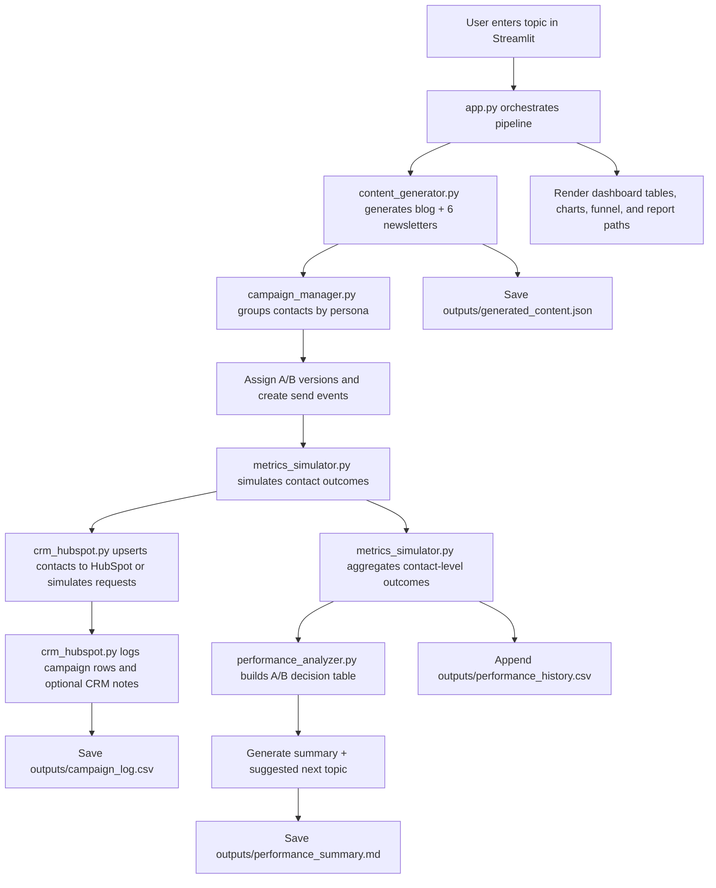

# NovaMind AI Content Pipeline

An end-to-end Streamlit application that generates a blog post and persona-specific newsletter variants for a fictional B2B startup, assigns A/B versions across audience segments, syncs contact-level campaign data to HubSpot (or simulates the sync), simulates engagement outcomes, aggregates funnel metrics, and produces an analytical performance report.

## Overview

This project was built around a simple growth-analytics scenario: NovaMind, a fictional startup serving small creative agencies, wants a lightweight pipeline that can generate AI-assisted content, distribute persona-based newsletter variants, log campaign activity to a CRM, and close the loop with performance analysis.

The application starts with a single content topic, generates one blog draft plus six newsletter variants (three personas × two A/B framings), assigns recipients to versions, records contact-level outcomes, writes campaign artifacts to disk, optionally upserts the enriched contact records into HubSpot, and finally summarizes experiment results in a dashboard and markdown report.

The UI is implemented in Streamlit and is intended to demonstrate both the operational workflow and the analytics workflow in one place.

## Architecture Overview

The repository is organized as a modular pipeline.

- `app.py` is the orchestration layer and dashboard UI. It loads environment variables, collects runtime options from the sidebar, runs the pipeline, persists results in Streamlit session state, and renders the generated content, CRM summary, funnel metrics, A/B comparison views, and exported artifact locations.
- `content_generator.py` handles blog and newsletter generation. It defines the three audience personas, the two A/B framings for each persona, and supports both live OpenAI generation and deterministic mock generation.
- `campaign_manager.py` segments recipients by persona, assigns A/B variants in alternating fashion, and builds campaign/send event records.
- `crm_hubspot.py` encapsulates HubSpot integration. It can simulate contact upserts and campaign note creation, or send real requests to HubSpot’s CRM APIs.
- `metrics_simulator.py` provides the baseline A/B assumptions, simulates contact-level opens/clicks/conversions/unsubscribes, aggregates those outcomes into reporting rows, and appends run history to CSV.
- `performance_analyzer.py` converts raw segment metrics into an analytical decision table, derives funnel efficiency metrics, produces an LLM-backed or mock written summary, and suggests the next content topic.
- `utils.py` centralizes paths, timestamp helpers, slug generation, and JSON persistence.
- `hubspot_connection_test.py` is a small connectivity check for the HubSpot Contacts API.

## Flow Diagram



## End-to-End Flow

1. The user launches the Streamlit app and chooses whether to use mock content or live OpenAI generation, and whether to simulate HubSpot or write to a live HubSpot account.
2. The app generates one blog outline, one blog draft, and six persona-specific newsletter variants:
   - Agency Founder / Owner: A = ROI framing, B = time-saving framing
   - Operations Manager: A = process reliability framing, B = speed and efficiency framing
   - Marketing / Growth Lead: A = content velocity framing, B = conversion optimization framing
3. Contacts are loaded from `data/mock_contacts.csv`.
4. Contacts are grouped by `persona_segment`, then split into A/B variants in alternating order.
5. The app simulates opens, clicks, conversions, and unsubscribes at the contact level using persona/version-specific baseline assumptions.
6. Contact records are either:
   - sent to HubSpot Contacts + Notes APIs, or
   - recorded as simulated API calls.
7. Contact-level outcomes are aggregated into campaign-level metric rows.
8. The app computes derived funnel metrics such as click-given-open and conversion-given-click.
9. A decision table is created for each persona segment using conversion rate as the primary metric, click rate as the secondary metric, and unsubscribe rate as a guardrail.
10. The app writes artifacts to the `outputs/` directory and renders the full dashboard in Streamlit.

## Project Structure

```text
.
├── app.py
├── campaign_manager.py
├── content_generator.py
├── crm_hubspot.py
├── hubspot_connection_test.py
├── metrics_simulator.py
├── performance_analyzer.py
├── utils.py
├── requirements.txt
├── .env.example
├── data/
│   └── mock_contacts.csv
└── outputs/
    ├── generated_content.json
    ├── campaign_log.csv
    ├── performance_history.csv
    └── performance_summary.md
```

## Tools, APIs, and Models Used

### Core Python libraries

- **Streamlit**: interactive UI and local dashboard
- **Pandas**: tabular transformations, aggregation, and display
- **python-dotenv**: environment variable loading from `.env`
- **requests**: HubSpot API calls
- **OpenAI Python SDK**: blog/newsletter generation and optional narrative summarization

### External APIs

- **OpenAI Responses API**
  - Used in `content_generator.py` for live blog outline, blog draft, and newsletter generation
  - Used in `performance_analyzer.py` for optional written performance summaries
  - Default model configured in the app: `gpt-4.1-mini`

- **HubSpot CRM API**
  - Contacts API for contact upserts
  - Notes API for campaign logging notes and note-to-contact associations

### Models / prompting roles

- `content_generator.py` uses prompt templates that frame the model as:
  - a B2B content strategist for outline generation
  - a startup content writer for blog generation
  - a concise B2B newsletter writer for persona-specific variant generation
- `performance_analyzer.py` uses the model as a growth analyst to summarize structured A/B results.

## Output Artifacts

Each pipeline run can generate or update the following files:

### `outputs/generated_content.json`
Contains the generated topic, timestamp, blog title, blog outline, blog body, and the six newsletter variants.

### `outputs/campaign_log.csv`
Contains campaign-level logging rows such as campaign ID, newsletter ID, persona segment, A/B version, recipient count, send timestamp, and CRM mode.

### `outputs/performance_history.csv`
Contains metric rows appended across runs, including sent count, open rate, click rate, unsubscribe rate, conversion rate, and raw event counts.

### `outputs/performance_summary.md`
Contains a human-readable markdown report with:
- raw A/B segment metrics
- analytical winner/tradeoff decisions
- a written summary
- a suggested next topic for iteration

## Sample Logic in the Current Implementation

The simulation currently uses hard-coded baseline metrics for each persona/version combination. For example:

- **Agency Founder / Owner**
  - A favors opens a bit more
  - B favors clicks and conversions a bit more
- **Operations Manager**
  - A favors clicks/conversions slightly
  - B favors opens slightly and keeps unsubscribe low
- **Marketing / Growth Lead**
  - A favors clicks/conversions slightly
  - B favors opens slightly

This creates plausible but lightweight A/B tradeoffs that the analyzer can interpret.

## Assumptions Made

### 1. Mock contacts are acceptable for local testing
The project assumes a synthetic contact list in `data/mock_contacts.csv`. This lets the full workflow run without requiring a production CRM export.

### 2. Simulated engagement is used unless real downstream email infrastructure exists
The project does not send real emails. Instead, it simulates email outcomes at the contact level using fixed conversion assumptions.

### 3. HubSpot is optional
If `HUBSPOT_ACCESS_TOKEN` is missing or live mode is disabled, HubSpot interactions are simulated. This keeps the pipeline runnable in offline/demo mode.

### 4. OpenAI is optional
If `OPENAI_API_KEY` is missing or mock mode is enabled, content generation falls back to deterministic mock blog/newsletter content.

### 5. A/B assignment is deterministic and simple
Recipients are assigned to variants in alternating order rather than randomized by a formal experiment service.

### 6. Winner selection is rule-based, not statistically significant
The analyzer uses heuristics rather than p-values or confidence intervals:
- primary metric: conversion rate
- secondary metric: click rate
- guardrail metric: unsubscribe rate

### 7. Repeated runs append to output history
`campaign_log.csv` and `performance_history.csv` are append-only in the current implementation, which means old runs accumulate unless the files are cleared manually.

### 8. The app is designed for demonstration, not production delivery
The current repository demonstrates orchestration, CRM integration patterns, A/B thinking, and performance reporting. It is not a production email-sending platform.

## Current Dashboard Behavior

The Streamlit app displays:

- persona definitions and A/B framing labels
- generated blog outline and blog body
- all newsletter variants
- CRM distribution summary
- HubSpot contact upsert result rows
- raw performance metric rows
- metric comparison chart with selectable KPI
- funnel view for a selected segment/version
- funnel-derived metrics table
- analytical decision table
- AI or mock performance summary
- saved artifact paths

The app stores the latest pipeline results in `st.session_state`, so changing dashboard widgets does not clear all run outputs.

## Environment Variables

Create a `.env` file based on `.env.example`:

```env
OPENAI_API_KEY=
HUBSPOT_ACCESS_TOKEN=
HUBSPOT_PERSONA_PROPERTY=
```

### Variable descriptions

- `OPENAI_API_KEY`: required only for live OpenAI content generation and live LLM summary generation
- `HUBSPOT_ACCESS_TOKEN`: required only for live HubSpot writes
- `HUBSPOT_PERSONA_PROPERTY`: optional custom HubSpot contact property internal name used to store persona segment labels

## Instructions to Run Locally

### 1. Clone the repository

```bash
git clone <your-repo-url>
cd <your-repo-folder>
```

### 2. Create and activate a virtual environment

**macOS / Linux**

```bash
python3 -m venv .venv
source .venv/bin/activate
```

**Windows (PowerShell)**

```powershell
python -m venv .venv
.venv\Scripts\Activate.ps1
```

### 3. Install dependencies

```bash
pip install -r requirements.txt
```

### 4. Configure environment variables

Copy `.env.example` to `.env` and fill in any keys you want to use.

```bash
cp .env.example .env
```

At minimum, the app can run with no keys if you use:
- mock OpenAI content generation
- simulated HubSpot mode

### 5. (Optional) Replace or expand the mock contact file

By default, the app reads:

```python
CONTACTS_PATH = DATA_DIR / "mock_contacts.csv"
```

If you want larger test runs, replace `data/mock_contacts.csv` with a larger synthetic contact file using the same schema.

### 6. Launch the Streamlit app

```bash
streamlit run app.py
```

Then open the local URL shown in the terminal, typically:

```text
http://localhost:8501
```

### 7. Run the pipeline

In the sidebar:
- choose mock vs. live OpenAI content generation
- choose simulated vs. live HubSpot mode
- optionally set a custom persona property name

Then:
- enter or keep the default topic
- click **Run pipeline**

### 8. Review outputs

After a run, inspect:

- the Streamlit dashboard
- `outputs/generated_content.json`
- `outputs/campaign_log.csv`
- `outputs/performance_history.csv`
- `outputs/performance_summary.md`

## Optional: Test HubSpot Connectivity Separately

If you want to test whether your HubSpot token works before running the full app:

```bash
python hubspot_connection_test.py
```

This sends a simple POST request to HubSpot Contacts API and prints the response.

## Limitations

- No real ESP or email-delivery platform is integrated; send events are logical records only.
- A/B assignment is simple alternation, not true randomization.
- No statistical significance testing is implemented yet.
- No persistent database is used; the app relies on CSV/JSON/markdown artifacts.
- Outputs are append-based and may contain multiple historical runs unless manually reset.
- The current HubSpot note logging associates one note per newsletter/campaign row, not per message event.

## Possible Extensions

- Add real email delivery via HubSpot Marketing Email, SendGrid, or Mailchimp
- Replace heuristic winner selection with significance tests and confidence intervals
- Add a database backend (Postgres / Snowflake / BigQuery)
- Add experiment metadata tracking and run IDs
- Add richer dashboarding with historical trend views
- Add automated scheduling or webhook-based triggering
- Expand mock data generation for larger-scale A/B simulation

## Why This Project Is Useful

This repository is a compact example of how AI-assisted content operations and analytics can be linked in one reproducible workflow. It demonstrates:

- prompt-based content generation
- persona-driven marketing segmentation
- lightweight experiment design
- CRM integration patterns
- funnel analytics
- rule-based experimental readouts
- file-based artifact generation for reproducibility

For portfolio purposes, it sits between a simple content-generation demo and a more realistic growth analytics workflow.
